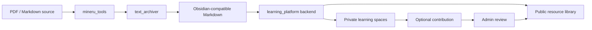

# Owlsome Learning Documentation Index

This folder is the project knowledge base for humans and future agents. Start here when you need to understand the repository quickly.

## Fast Path

1. [Agent handoff guide](agent_handoff_guide.md) - architecture, module boundaries, core workflows, run commands, and safe-change notes.
2. [Design system](design_system.md) - NJU purple theme tokens, accessibility rules, and frontend visual conventions.
3. [Project proposal](owlsome_learning_project_proposal.md) - staged roadmap, acceptance criteria, and product rationale.
4. [Implementation overview](implementation_overview.md) - concise pipeline summary and Stage 3 contribution API overview.

## Technical Modules

- [PDF to Markdown implementation](pdf_to_markdown_implementation.md) - MinerU parsing workflow and API boundaries.
- [Markdown cleanup implementation](markdown_cleanup_implementation.md) - `text_archiver` chunking, profiling, parallel cleanup, checkpointing, and reports.
- [Obsidian compatibility](obsidian_compatibility.md) - supported Markdown conventions and normalization policy.
- [AnyReader reuse strategy](anyreader_reuse_strategy.md) - UI/reading features worth absorbing from the reference product.
- [UI collaboration guide](ui_collaboration_guide.md) - how teammates should design and hand off interface changes.
- [Version control strategy](version_control_strategy.md) - commit, push, branch, and sensitive-file rules.

## Test Records

Test and validation notes live under [test_records](test_records/). Important records include:

- [text_archiver parallel cleanup tests](test_records/text_archiver_parallel_cleanup_tests.md)
- [learning platform seed demo tests](test_records/learning_platform_seed_demo_tests.md)
- [retrieval adapter tests](test_records/retrieval_adapter_tests.md)
- [full Calculus II import report](test_records/calculus_full_import_report.md)

## Current Product Shape

