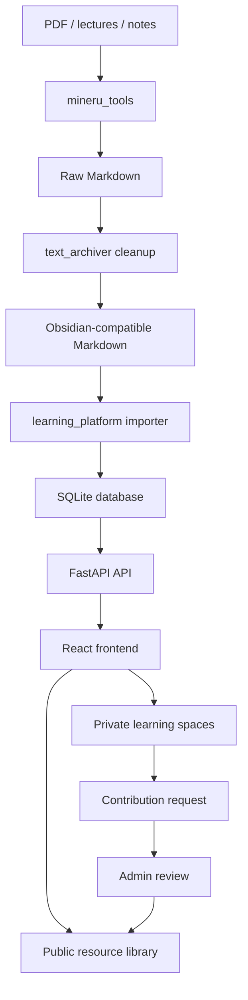
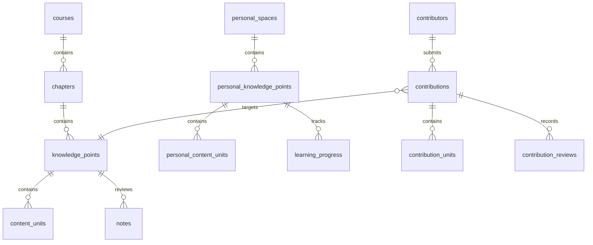
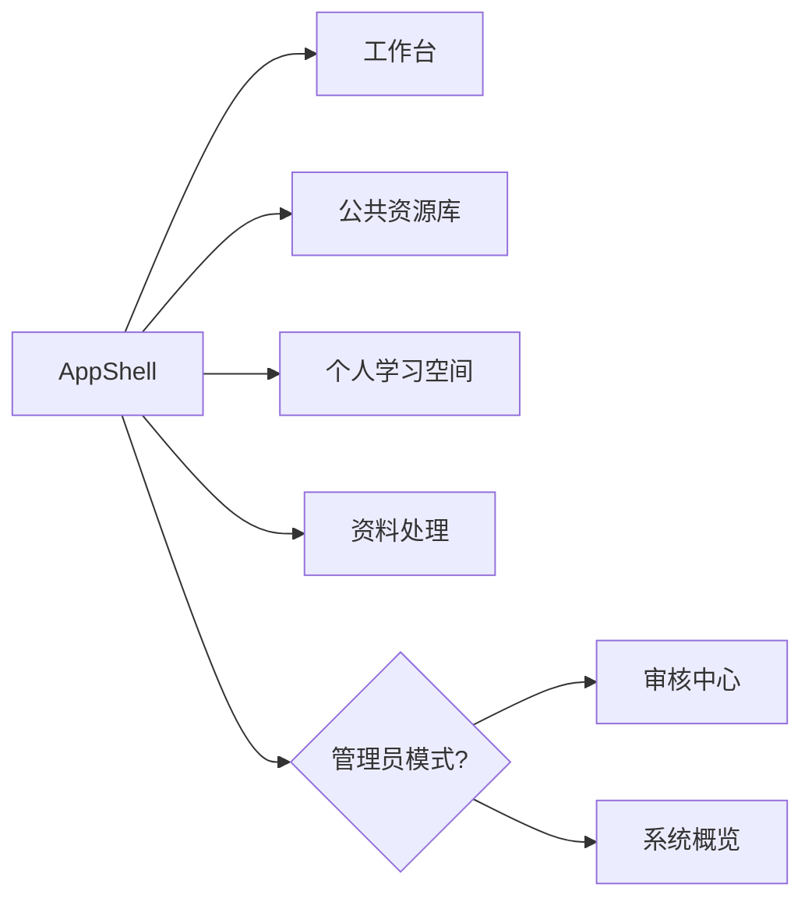
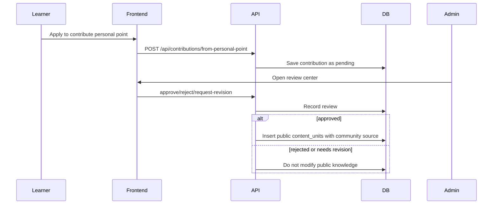

# Agent Handoff Guide

This guide is written for future agents and teammates who need to understand Owlsome Learning quickly, make safe changes, and avoid breaking the demo path.

## 1. Project Snapshot

Owlsome Learning is an AI-assisted math learning platform for the EL interaction track. It turns PDF or Markdown learning material into structured learning spaces, then separates private learning from public community knowledge.

Primary product loop:

```text
Source material
-> Markdown parsing / cleanup
-> structured knowledge points
-> private learning or public resource library
-> learner Q&A and progress
-> optional contribution
-> admin review
-> community content merged into public knowledge
```

Current implementation is a local demo, not a full production deployment. It is intentionally built with lightweight tools:

- Backend: FastAPI + SQLite
- Frontend: React + Vite + TypeScript
- Markdown: Obsidian-compatible Markdown with KaTeX math rendering
- PDF parsing: MinerU toolchain
- Markdown cleanup: `text_archiver` with OpenAI-compatible LLM API
- Retrieval: optional BGE-compatible HTTP adapter, default off

## 2. Repository Map

```text
D:\Projects\EL
├─ learning_platform
│  ├─ backend          # FastAPI app, SQLite schema, import/seed/retrieval scripts
│  ├─ frontend         # React demo UI
│  └─ sample_data      # tracked small Markdown sample
├─ mineru_tools        # PDF/document parsing, PDF -> Markdown
├─ text_archiver       # Markdown cleanup, profiling, parallel LLM processing
├─ owlsome_core        # Obsidian compatibility helpers shared by tools
├─ docs                # architecture, roadmap, implementation docs, test records
└─ 项目书_初稿.md       # early project book / background notes
```

Generated or sensitive files should not be committed:

- `learning_platform/backend/data/*.db`
- `learning_platform/backend/data/*.bak`
- `learning_platform/frontend/dist`
- `learning_platform/frontend/node_modules`
- `mineru_tools/output`
- `.env` files

## 3. Architecture



### Module Boundaries

| Module | Owns | Should not own |
|---|---|---|
| `mineru_tools` | PDF parsing jobs, MinerU client/web UI, raw Markdown output | learning UI, knowledge review workflow |
| `text_archiver` | Markdown cleanup, Obsidian normalization, LLM chunk processing | database writes, frontend state |
| `owlsome_core` | shared Markdown normalization helpers | API calls, project-specific data models |
| `learning_platform/backend` | database schema, import, segmentation, notes, contributions, QA, retrieval adapter | PDF parsing implementation |
| `learning_platform/frontend` | learner/admin UI, Markdown rendering, resource navigation | security-grade authorization |

## 4. Learning Platform Backend

Backend entrypoint:

```text
D:\Projects\EL\learning_platform\backend\app\main.py
```

Important files:

| File | Purpose |
|---|---|
| `app/db.py` | SQLite path, schema creation, row helpers |
| `app/models.py` | Pydantic request/response models |
| `app/pipelines/importer.py` | sample public knowledge import, prefers cleaned `merged_full_formatted.md` |
| `app/pipelines/calculus_full_importer.py` | shared full Calculus II import service used by API and CLI |
| `app/pipelines/segmenter.py` | chapter/knowledge-point/content-unit splitting rules |
| `app/services/personal.py` | private Markdown spaces and progress |
| `app/services/notes.py` | note submission, matching, approval/rejection |
| `app/services/contributions.py` | private-to-public contribution workflow |
| `app/services/qa.py` | offline Q&A and optional LLM Q&A |
| `app/services/retrieval.py` | optional BGE embedding/reranker adapter |
| `scripts/seed_demo.py` | one-command demo data preparation |
| `scripts/import_calculus_full.py` | full cleaned Calculus II structural import probe/import |
| `scripts/retrieval_probe.py` | CLI validation for optional retrieval matching |

### Database Concept Map



### Core API Groups

| API group | Endpoints |
|---|---|
| Health/stats | `GET /api/health`, `GET /api/stats` |
| Public resources | `POST /api/import/sample`, `POST /api/import/calculus-full`, `GET /api/courses`, `GET /api/knowledge-points`, `GET /api/knowledge-points/{id}` |
| Notes | `POST /api/notes`, `GET /api/notes/pending`, `POST /api/notes/{id}/approve`, `POST /api/notes/{id}/reject` |
| Public Q&A | `POST /api/qa` |
| Personal spaces | `POST /api/personal-spaces/upload-markdown`, `POST /api/personal-spaces/from-sample`, `GET /api/personal-spaces`, `GET /api/personal-spaces/{id}` |
| Personal points | `GET /api/personal-spaces/{space_id}/knowledge-points/{point_id}`, `POST /api/personal-spaces/{space_id}/knowledge-points/{point_id}/progress` |
| Personal Q&A | `POST /api/personal-spaces/{space_id}/qa` |
| Contributions | `POST /api/contributions/from-personal-point`, `GET /api/contributions/pending`, `GET /api/contributions/{id}`, `POST /api/contributions/{id}/approve`, `POST /api/contributions/{id}/reject`, `POST /api/contributions/{id}/request-revision` |

## 5. Learning Platform Frontend

Frontend entrypoint:

```text
D:\Projects\EL\learning_platform\frontend\src\main.tsx
```

The frontend is split into a thin app shell plus page-level components:

| File | Purpose |
|---|---|
| `src/App.tsx` | shared state, API orchestration, tab/role routing |
| `src/api.ts` | API base URL and fetch wrapper |
| `src/types.ts` | TypeScript data contracts |
| `src/components/AppShell.tsx` | sidebar, topbar, local role switch |
| `src/components/MarkdownRenderer.tsx` | Obsidian-compatible Markdown rendering |
| `src/pages/Dashboard.tsx` | learner workbench |
| `src/pages/KnowledgeBase.tsx` | public resource hierarchy and point detail |
| `src/pages/PersonalSpaces.tsx` | upload/sample creation, private space tree, progress, contribution, QA |
| `src/pages/Pipeline.tsx` | parsing/cleanup pipeline explanation |
| `src/pages/ReviewCenter.tsx` | admin-only notes/contributions review |
| `src/pages/SystemOverview.tsx` | admin-only system/import overview |
| `src/styles.css` | NJU purple theme tokens and all UI styles |

### UI Information Architecture



Important current behavior:

- Default role is `learner`.
- `review` and `system` tabs are hidden unless the local role switch is set to `admin`.
- This is demo-level UI isolation, not backend authorization.
- Public and personal sidebars use Obsidian-like expandable navigation trees.
- Markdown uses Obsidian conventions such as frontmatter, callouts, wikilinks, highlights, and LaTeX.

## 6. Document Processing Pipeline

### PDF to Markdown

`mineru_tools` delegates parsing to MinerU. It is responsible for taking source PDFs or documents and producing Markdown plus related assets.

Typical output used by the demo:

```text
D:\Projects\EL\mineru_tools\output\...\merged_full.md
```

### Markdown Cleanup

`text_archiver` repairs line breaks, headings, formatting, formulas, and Obsidian compatibility. It supports:

- serial cleanup
- automatic book profile sampling
- parallel chunk cleanup
- checkpoint resume
- JSON report output
- Obsidian post-processing

The cleaned full textbook path used by the importer when present:

```text
D:\Projects\EL\mineru_tools\output\20260523_113153_Wei Ji Fen II(Di Si Ban ) - Zhang Yun Qing\merged_full_formatted.md
```

### Knowledge Segmentation

`learning_platform/backend/app/pipelines/segmenter.py` currently has two levels:

- stable demo segmentation for Calculus II Chapter 5 `5.1-5.2`
- full-book structural splitting for chapters, sections, definitions, theorems, examples, and exercises

The segmentation is rule-first. LLM enhancement is planned but must not be required for offline demo.

## 7. Contribution Workflow

Private content never enters the public library automatically.



Approval inserts a new public `content_units` row with:

```text
source = community_contribution:{contribution_id}
```

The frontend uses that source prefix to display a community-content label.

## 8. Optional Retrieval Layer

The BGE retrieval layer is currently optional and off by default. It is designed for future local or intranet deployment:

- Embedding model: `BAAI/bge-m3`
- Reranker model: `BAAI/bge-reranker-v2-m3`

Configuration lives in:

```text
D:\Projects\EL\learning_platform\backend\.env.example
```

When `RETRIEVAL_PROVIDER=off` or the service is unavailable, note/contribution matching falls back to keyword rules. Do not remove this fallback.

Probe command:

```powershell
cd D:\Projects\EL\learning_platform\backend
python scripts\retrieval_probe.py --query "二重极限为什么不能只看一条路径" --top-k 8 --rerank-top-k 3 --ensure-sample
```

## 9. Runbook

### Backend

```powershell
cd D:\Projects\EL\learning_platform\backend
python -m pip install -r D:\Projects\EL\learning_platform\backend\requirements.txt
python -m uvicorn app.main:app --host 127.0.0.1 --port 8000 --reload
```

Health check:

```powershell
Invoke-WebRequest -UseBasicParsing http://127.0.0.1:8000/api/health
```

### Frontend

```powershell
cd D:\Projects\EL\learning_platform\frontend
npm install
npm run dev
```

Open:

```text
http://127.0.0.1:5173
```

### Seed Demo Data

Stop the backend first if Windows locks the SQLite file, then run:

```powershell
cd D:\Projects\EL\learning_platform\backend
python scripts\seed_demo.py --all
```

Expected result:

- public resource library has the chapter-5 demo points
- one personal sample space exists
- one pending contribution exists
- one approved community contribution is visible in public detail

### Full Calculus II Import

Admin UI path:

```text
管理员模式 -> 系统概览 -> 微积分 II 全书导入
```

Backend API:

```text
POST /api/import/calculus-full
```

Typical body:

```json
{"dry_run": false, "reset_course": true, "write_report": true}
```

Dry-run report:

```powershell
cd D:\Projects\EL
python D:\Projects\EL\learning_platform\backend\scripts\import_calculus_full.py --dry-run --report D:\Projects\EL\docs\test_records\calculus_full_import_report.md
```

Real import:

```powershell
cd D:\Projects\EL\learning_platform\backend
python scripts\import_calculus_full.py --import --reset-course
```

## 10. Validation Checklist

Use these checks after meaningful backend/frontend changes:

```powershell
cd D:\Projects\EL\learning_platform\backend
python -m compileall D:\Projects\EL\learning_platform\backend\app D:\Projects\EL\learning_platform\backend\scripts
```

```powershell
cd D:\Projects\EL\learning_platform\frontend
npm run build
```

Manual browser checks:

- learner mode hides admin review/system tabs
- admin mode shows review center and system overview
- public resource tree expands/collapses
- personal space tree expands/collapses
- Markdown formulas and callouts render
- contribution approval creates community-labeled content

## 11. Safe Change Rules

- Keep `mineru_tools` and `text_archiver` reusable; do not bake frontend-specific behavior into them.
- Preserve offline demo paths. LLM, MinerU token, and BGE services must remain optional.
- Do not commit `.env`, SQLite databases, generated full textbook output, or frontend build output.
- When changing DB schema, use `CREATE TABLE IF NOT EXISTS` style migrations until a formal migration tool is introduced.
- When changing matching logic, preserve keyword fallback.
- When changing UI role visibility, remember it is presentation-only until backend auth is added.
- Before resetting demo data, warn that `learning_platform/backend/data/learning_platform.db` will be backed up and recreated.

## 12. Known Near-Term Work

1. Persist frontend tab/tree state in URL or localStorage for better collaboration and demos.
2. Add search and filtering to public/personal resource trees.
3. Promote full Calculus II import from probe to product path after content QA.
4. Add real backend role checks after 南哪小帮手 login integration.
5. Connect optional BGE retrieval to question-to-knowledge-point matching once the service is deployed.
6. Add a formal migration path before moving from SQLite to PostgreSQL.
